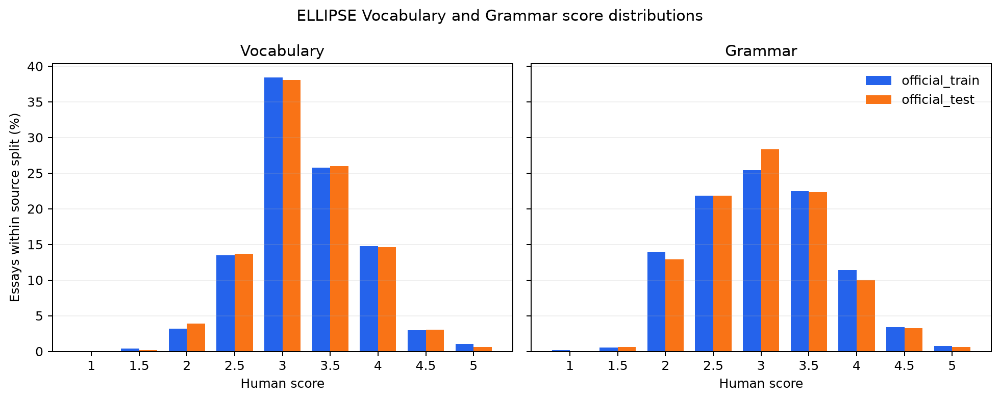
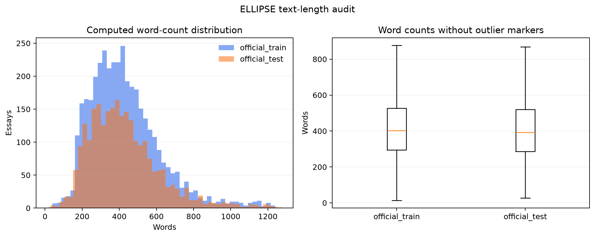
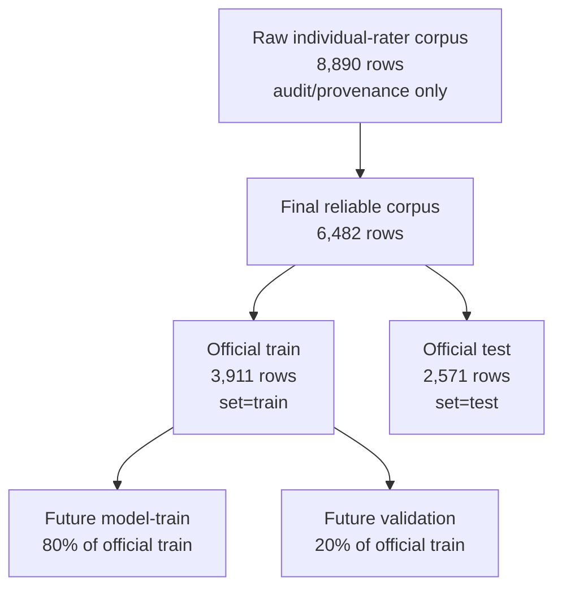

# Phase 2 Dataset Inventory and Quality Audit

> **Audit date:** 2026-09-23  
> **Status:** Phase 2 evidence complete. The hold recorded here was resolved before Phase 5 by
> excluding every row not marked `not_flagged` from fitting and evaluation.  
> **Scope:** Read-only inspection of the local ELLIPSE snapshot. No prediction model was trained.

## Executive result

The local final ELLIPSE release contains exactly **6,482 reliable essays**: **3,911** in the
official train file and **2,571** in the official test file. Every final row has nonblank text,
`Vocabulary`, and `Grammar`. The separate raw-rater file contains **8,890** rows and is provenance
and rater-audit material, not model-ready training data.

The most important quality finding is privacy-related: among 6,468 final rows that can be joined
exactly to the raw-rater file, **138** were marked `Identifying_Info=1` by at least one rater. No
essay text or identifying fragment is reproduced in this report. A handling rule for these rows
must be approved before feature extraction or model training.

## 2.1 Source, version, license, and local files

| Item | Verified value |
|---|---|
| Dataset | ELLIPSE Corpus v1.0 |
| Primary source | `https://github.com/scrosseye/ELLIPSE-Corpus` |
| Pinned source commit | `dc3b8f0b3b4332fc9f64302c4ccfc4ed582f4b43` |
| Local retrieval date | 2026-09-21 |
| Paper | Crossley et al., *Measuring second language proficiency using the ELLIPSE Corpus* |
| License | CC BY-NC-SA 4.0 |
| Source documentation | `data/01_original_source/documentation/ELLIPSE_README.md`, `data/01_original_source/documentation/SOURCE.md` |
| Scoring documentation | `data/01_original_source/documentation/ELL_Rubrics.docx` |

### File inventory verified from disk

| Role | Local file | Bytes | Rows | Columns | SHA-256 result |
|---|---|---:|---:|---:|---|
| Official train | `ELLIPSE_Final_github_train.csv` | 9,861,486 | 3,911 | 26 | Matches recorded checksum |
| Official test | `ELLIPSE_Final_github_test.csv` | 6,383,207 | 2,571 | 26 | Matches recorded checksum |
| Raw individual ratings | `ellipsis_raw_rater_scores_anon_all_essay.csv` | 21,768,627 | 8,890 | 21 | Matches recorded checksum |
| Official rubric | `ELL_Rubrics.docx` | 17,420 | — | — | Matches recorded checksum |
| Upstream README snapshot | `ELLIPSE_README.md` | 2,666 | — | — | Matches recorded checksum |

Full hashes and file-level completeness counts are in
[`phase2_tables/file_inventory.csv`](data/phase2_tables/file_inventory.csv). The verified hashes
match [`SOURCE.md`](../data/01_original_source/documentation/SOURCE.md).

## 2.2 Rows, columns, types, and required-field completeness

| File | Rows | Nonblank text | Complete text + Vocabulary + Grammar | Interpretation |
|---|---:|---:|---:|---|
| Official train | 3,911 | 3,911 | 3,911 | Model development source |
| Official test | 2,571 | 2,571 | 2,571 | Frozen final evaluation source |
| Raw rater | 8,890 | 8,890 | 8,890 with both raters' Vocabulary and Grammar | Rater audit only; no canonical aggregate target columns |

The two final files have the same 26-column schema:

- **String/object:** `text_id_kaggle`, `full_text`, `gender`, `race_ethnicity`, `task`, `SES`,
  `prompt`, `set`.
- **Integer:** `grade`, `num_words`, `num_words2`, `num_words3`, `num_sent`, `num_para`, `Type`,
  `Token`.
- **Float:** `num_word_div_para`, `MTLD`, `TTR`, `Overall`, `Cohesion`, `Syntax`, `Vocabulary`,
  `Phraseology`, `Grammar`, `Conventions`.

All final columns are complete except one missing `SES` value in official test. This does not affect
model input because demographic columns are prohibited features. Exact per-file dtypes, missing
counts, and unique counts are in
[`phase2_tables/column_profile.csv`](data/phase2_tables/column_profile.csv).

The raw-rater file stores two integer ratings for each rubric dimension (`*_1`, `*_2`) and rater
identifiers. Its raw rating columns contain values 0–5; zero occurs in 18 Vocabulary ratings for
each rater and 18 Grammar ratings for each rater. These raw zeros are not valid final model targets
and must not be mixed with the final aggregate scores. See
[`phase2_tables/raw_rater_score_summary.csv`](data/phase2_tables/raw_rater_score_summary.csv).

## 2.3 Actual target scale, missing values, and distributions

### Target summary

| Source split | Target | Missing | Min | Q1 | Median | Mean | Q3 | Max | Distinct |
|---|---|---:|---:|---:|---:|---:|---:|---:|---:|
| Official train | Vocabulary | 0 | 1.0 | 3.0 | 3.0 | 3.2357 | 3.5 | 5.0 | 9 |
| Official train | Grammar | 0 | 1.0 | 2.5 | 3.0 | 3.0329 | 3.5 | 5.0 | 9 |
| Official test | Vocabulary | 0 | 1.5 | 3.0 | 3.0 | 3.2236 | 3.5 | 5.0 | 8 |
| Official test | Grammar | 0 | 1.0 | 2.5 | 3.0 | 3.0243 | 3.5 | 5.0 | 9 |

Across both final files, both targets use the observed set
`{1.0, 1.5, 2.0, 2.5, 3.0, 3.5, 4.0, 4.5, 5.0}`. Official-test Vocabulary alone has no 1.0
example. Predictions must remain continuous for metric calculation and must not be rounded to 0.5.

### Exact count distribution

| Score | Vocabulary train | Vocabulary test | Grammar train | Grammar test |
|---:|---:|---:|---:|---:|
| 1.0 | 2 | 0 | 8 | 1 |
| 1.5 | 14 | 4 | 20 | 16 |
| 2.0 | 124 | 100 | 544 | 332 |
| 2.5 | 528 | 352 | 855 | 562 |
| 3.0 | 1,503 | 978 | 994 | 729 |
| 3.5 | 1,007 | 668 | 880 | 574 |
| 4.0 | 577 | 376 | 447 | 258 |
| 4.5 | 115 | 78 | 134 | 83 |
| 5.0 | 41 | 15 | 29 | 16 |

The distributions are concentrated around 3.0–3.5, with very few examples at the extremes. This
must be considered in later error analysis, especially for score 1.0 and 5.0 slices. Exact counts
and percentages are in
[`phase2_tables/score_distribution.csv`](data/phase2_tables/score_distribution.csv).

Inspection of official-test labels in this phase was limited to predeclared aggregate data-quality
statistics. Test performance, examples, residuals, model choices, and thresholds remain unseen and
must not be selected using this distribution.

## 2.4 Text and identifier quality

The audit computed word counts directly from `full_text`; source-provided `num_words*` columns were
not trusted as the definition of text length.

| Source split | Rows | Blank | <50 words | <100 words | Min | Q1 | Median | Q3 | Max |
|---|---:|---:|---:|---:|---:|---:|---:|---:|---:|
| Official train | 3,911 | 0 | 2 | 22 | 14 | 294 | 402 | 527 | 1,239 |
| Official test | 2,571 | 0 | 4 | 15 | 27 | 286 | 392 | 520 | 1,274 |
| **Combined** | **6,482** | **0** | **6** | **37** | **14** | — | **399** | — | **1,274** |

`<50` and `<100` are audit thresholds, not automatic exclusion rules. IDs for the 37 essays below
100 words are recorded without essay text in
[`phase2_tables/short_text_ids_under_100_words.csv`](data/phase2_tables/short_text_ids_under_100_words.csv).

### Duplicate checks on the 6,482 final rows

| Check | Definition | Result |
|---|---|---:|
| Duplicate ID | Repeated `text_id_kaggle` within combined final files | 0 groups |
| Exact duplicate text | Casefold + trim + collapse whitespace, then exact equality | 0 groups |
| Near duplicate | Best non-self cosine similarity >=0.95 on char-wb TF-IDF 5-grams | 0 pairs |
| Cross-split near duplicate | Same rule with one row in each official split | 0 pairs |

The near-duplicate result rules out very high lexical overlap under the declared method; it does
not rule out paraphrases or semantically similar responses. The empty, schema-bearing output is
[`phase2_tables/near_duplicate_pairs.csv`](data/phase2_tables/near_duplicate_pairs.csv).

### Raw-to-final linkage and privacy finding

- Raw-rater `text_id_kaggle` is non-null for 6,482 rows, but only 6,468 IDs exactly match final IDs.
- The raw file contains 27 IDs formatted in scientific notation. Fourteen final IDs therefore have
  no exact string match; the displayed scientific notation is too lossy for a reliable repair.
- `Identifying_Info_1=1` occurs in 63 raw rows; `Identifying_Info_2=1` occurs in 146 raw rows.
- Among the 6,468 exactly linkable final rows, 138 are flagged by at least one rater.

Consequently, raw free text must not be displayed, committed, or used to produce qualitative
examples. This finding created a training hold. Before Phase 5, the project resolved it by excluding
all `flagged_by_rater` and `unresolved_raw_id_link` rows from fitting and evaluation.

## 2.5 Official split, writer ID, and prompt ID

- The official split is explicit: every train row has `set="train"`; every test row has
  `set="test"`.
- There is **no stable writer/learner ID** in the local final schema. Demographic combinations must
  not be treated as a proxy writer ID.
- `prompt` is present and complete in both final files, with **44 distinct local prompt strings**.
  This is the observed field cardinality and should not be silently replaced with the paper's
  higher-level prompt count.
- All 6,482 final rows have `task="Independent"`.
- `prompt` may be used for distribution checks and error slices, never as a model feature.

## 2.6 Rubric to planned-feature mapping

The official rubric defines integer performance levels 1–5. Final half-point scores are aggregate
human scores, not additional rubric descriptors.

| Target | What the rubric evaluates | Planned self-extracted features | Coverage and limitation |
|---|---|---|---|
| Vocabulary | Range of vocabulary; flexibility and precision; topic-related and less common words; accuracy of word use and word forms | Type-token ratio, root TTR, lexical density, mean Zipf frequency, rare-word ratio | Covers diversity/frequency only partially. It does not directly establish contextual appropriateness, precision of meaning, topic-term correctness, or word-formation accuracy. |
| Grammar | Frequency and pervasiveness of errors in grammar and usage, from few/no errors at level 5 to errors throughout at level 1 | LanguageTool issue count and issues per 100 words; syntax/POS features as supporting descriptors | Automated matches can be false positives, style suggestions, or dialect-sensitive. Counts do not measure error severity and are not ground-truth error labels. |
| Both/context | Rubric judgments are made on a complete writing sample | Character/word/sentence/paragraph counts and average lengths | Length is not a rubric score by itself and can become a shortcut; compare Surface-only against Linguistic-only and All Features. |

Rubric wording supports the two targets but does not prove that adjacent levels represent equal
proficiency distances. Regression therefore remains an explicit approximate-continuity assumption.

## 2.7 Allowed-column catalog

| Category | Columns | Model-input rule |
|---|---|---|
| Raw text | `full_text` | Allowed source input; model features are recomputed locally from it. |
| Identifier | `text_id_kaggle` | Tracking, joins, split manifests, and tie-breaking only; never a feature. |
| Source-precomputed text features | `num_words`, `num_words2`, `num_words3`, `num_sent`, `num_para`, `num_word_div_para`, `MTLD`, `TTR`, `Type`, `Token` | Audit/validation only by default. Do not feed them to models; use the same local extractor for train and inference. |
| Context/split | `task`, `prompt`, `set` | Audit, split verification, and slice analysis only; never features. |
| Demographic | `gender`, `grade`, `race_ethnicity`, `SES` | Prohibited as model features. Fairness audit only with adequate group size and privacy controls. |
| Selected labels | `Vocabulary`, `Grammar` | Targets only; never inputs or feature-engineering sources. |
| Other human scores | `Overall`, `Cohesion`, `Syntax`, `Phraseology`, `Conventions` | Prohibited inputs because they are human labels and would leak assessment information. |
| Raw-rater fields | `Rater_*`, `*_1`, `*_2`, `Identifying_Info_*` | Rater/provenance/privacy audit only; not part of the modeling table. |

The machine-readable version is
[`phase2_tables/column_usage_catalog.csv`](data/phase2_tables/column_usage_catalog.csv). Planned
self-extracted features are declared separately in `configs/features.yaml`; a source column with a
similar name does not authorize its use.

## Phase 2 gate

Phase 2 is complete because every reported number above is derived from the local files and can be
reproduced with `uv run --extra analysis python scripts/phase2_dataset_audit.py`.

At Phase 2 completion, training was blocked on the following decisions. Their current resolution is:

1. resolved before Phase 5: use only rows marked `not_flagged`;
2. resolved in Phase 4: retain short essays and apply documented finite short-text feature rules;
3. resolved in Phase 3: freeze the 80/20 model-train/validation manifest;
4. continuing rule: keep official test isolated from feature, hyperparameter, and threshold selection;
5. continuing rule: retain only locally recomputed text features in the modeling matrix.
