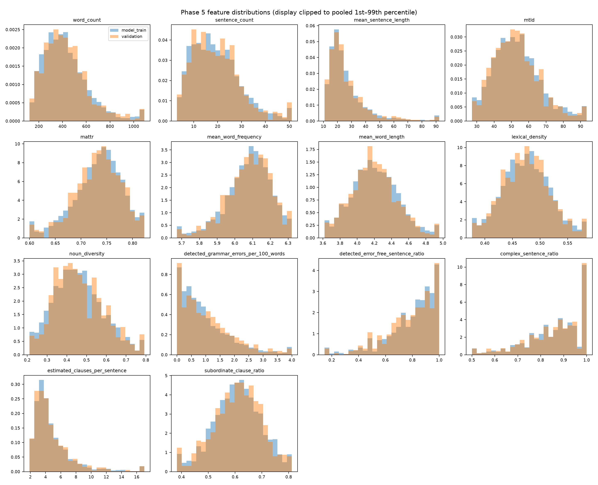

# Phase 5 Feature Audit and Validation Baselines

> **Completed:** 2026-09-23  
> **Evaluation scope:** eligible model-train and validation rows only  
> **Official test:** not loaded

## Outcome

The 14-feature table passed the Phase 5 completeness, finite-value, variability, and
train-validation stability checks. One strongly related feature pair needs interpretive caution:
`mean_sentence_length` and `estimated_clauses_per_sentence` have Pearson correlation 0.9728 on
model-train. No feature was removed because the 14-feature schema is frozen and this audit did not
use validation performance to redesign it.

The baseline results show that essay length carries some signal for Vocabulary and little signal
for Grammar. The length-only disagreement queue did not outperform uniform random review on
validation. This creates a clear benchmark for the later all-feature models; it does not yet test
whether the full linguistic feature set adds value.

## Privacy and evaluation population

Before any baseline was fitted, the project adopted the conservative rule that only rows with
`privacy_review_status=not_flagged` are eligible. Split assignments remain unchanged.

| Partition | Frozen rows | Eligible rows | Excluded flagged | Excluded unresolved |
|---|---:|---:|---:|---:|
| Model train | 3,128 | 3,050 | 68 | 10 |
| Validation | 783 | 762 | 17 | 4 |

Excluded rows do not influence feature diagnostics, imputation, scaling, model fitting, prediction,
or validation metrics. Prompt, privacy status, ID, demographics, and human scores are not model
features.

## Feature quality and stability

Checks use model-train-derived rules. Outliers are flagged using 1.5 times the train IQR; they are
not deleted, clipped, or winsorized. Stability is accepted only when absolute standardized mean
difference is at most 0.20, PSI is at most 0.10, and KS distance is at most 0.10.

| Check | Result |
|---|---:|
| Missing values across 14 features | 0 |
| Infinite values across 14 features | 0 |
| Near-constant features | 0 |
| Features failing stability thresholds | 0 |
| Highly similar pairs at absolute Pearson or Spearman >=0.95 | 1 |
| Largest absolute SMD | 0.0788, detected grammar errors/100 words |
| Largest KS statistic | 0.0741, detected grammar errors/100 words |
| Largest PSI | 0.0293, noun diversity |

The largest train IQR outlier shares are 6.49% for `mean_sentence_length` and 6.46% for
`estimated_clauses_per_sentence`; validation shares are similar at 6.69% and 6.56%. These are
consistent with the run-on and low-punctuation essays identified in Phase 4 rather than evidence of
row misalignment.

The only high-similarity pair is:

| Feature A | Feature B | Pearson | Spearman | Interpretation |
|---|---|---:|---:|---|
| `mean_sentence_length` | `estimated_clauses_per_sentence` | 0.9728 | 0.9374 | Both increase for long/run-on sentences and share sentence count in their denominators. Ridge regularization reduces numerical sensitivity, but individual coefficients should not be interpreted independently. |



## Prediction baselines on validation

The mean baseline predicts each eligible model-train target mean. The length-only models use only
`word_count`, `sentence_count`, and `mean_sentence_length`. Ridge uses fixed `alpha=1.0`; Random
Forest uses the frozen configuration of 300 trees, minimum leaf size 2, square-root feature
sampling, seed 42, and one worker for byte-stable predictions. No hyperparameter was selected on
validation.

| Baseline | Target | MAE | RMSE | R-squared |
|---|---|---:|---:|---:|
| Train mean | Vocabulary | 0.4656 | 0.5742 | -0.0014 |
| Length Ridge | Vocabulary | **0.4361** | **0.5524** | **0.0730** |
| Length Random Forest | Vocabulary | 0.4580 | 0.5796 | -0.0204 |
| Length consensus | Vocabulary | 0.4377 | 0.5533 | 0.0701 |
| Train mean | Grammar | 0.5495 | 0.6819 | -0.0009 |
| Length Ridge | Grammar | **0.5428** | **0.6703** | **0.0326** |
| Length Random Forest | Grammar | 0.5662 | 0.7103 | -0.0863 |
| Length consensus | Grammar | 0.5432 | 0.6739 | 0.0224 |

Relative to the train-mean MAE, length Ridge improves Vocabulary by 6.3% and Grammar by 1.2%.
Random Forest with only three length variables is worse than the mean baseline for both targets.
The low R-squared values show that length alone explains little validation-score variation,
especially for Grammar.

## Review baseline on validation

For this baseline only, the review score is the maximum Vocabulary/Grammar disagreement between
the length-only Ridge and Random Forest. The reference prediction is their mean. A large-error case
has a maximum target absolute error of at least 1.0 point, following the frozen Phase 1 definition.

At the primary 20% review budget, 153 of 762 essays are selected. There are 130 large-error cases
(17.06% prevalence).

| Strategy | Captured | Capture rate | Precision | Lift | Interval basis |
|---|---:|---:|---:|---:|---|
| Length-only disagreement | 25/130 | 0.1923 | 0.1634 | 0.9578 | Deterministic queue |
| Uniform random | Mean over 1,000 draws | 0.2023 | 0.1719 | 1.0076 | 95% percentile intervals: capture 0.1460–0.2692; precision 0.1240–0.2288; lift 0.7269–1.3409 |

The length-only disagreement queue is slightly worse than random in this validation run and has
lift below 1. This is useful negative evidence: model disagreement is not automatically an
effective review signal. The later all-feature comparison must beat the length-only predictive
MAE and the same-size random-review distribution before claiming added linguistic value.

## Outputs and reproducibility

Run:

```powershell
uv run --extra analysis python scripts/phase5_feature_audit_and_baselines.py
```

Tracked outputs are in `docs/data/phase5_tables/`:

- `feature_quality_summary.csv`
- `feature_stability.csv`
- `feature_correlations.csv`
- `baseline_regression_metrics.csv`
- `review_baselines.csv`
- `phase5_audit_summary.json`

The text-free validation predictions are written to the ignored local path
`outputs/predictions/phase5_validation_baselines.csv`. A reader-friendly workbook is written to
`outputs/phase5/phase5_baselines.xlsx`.

Two consecutive full reruns produced identical hashes for the regression table, review table, and
validation prediction file. The Random Forest baseline uses one worker to avoid last-bit floating
point variation from parallel aggregation.

## Phase gate

Phase 5 is complete. The next phase may fit the predeclared linguistic/all-feature model conditions
on eligible model-train rows and compare them on eligible validation rows. Official-test features
and labels must remain unopened until feature condition, hyperparameters, and review protocol are
frozen.
