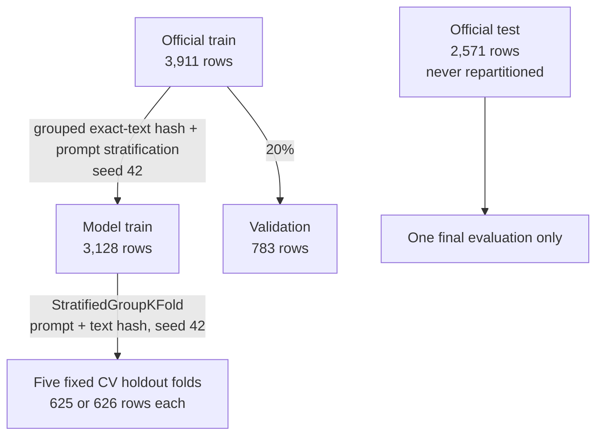

# Phase 3 Data Split and Leakage-Control Protocol

> **Frozen on:** 2026-09-23  
> **Status:** Split design and leakage audit passed.  
> **Privacy gate update:** Phase 5 excludes every row not marked `not_flagged`; development baseline
> fitting is permitted under this rule. Official test remains frozen.

## Outcome

The official ELLIPSE test file remains unchanged as the final held-out test. The 3,911 rows in the
official training file were divided into 3,128 model-train rows and 783 validation rows. Every
model-train row also has one of five fixed cross-validation holdout folds.

| Partition | Rows | Purpose | May influence feature/hyperparameter/threshold decisions? |
|---|---:|---|---|
| Model train | 3,128 | Fit models and learned preprocessing; run five-fold CV | Yes, through fold-safe CV |
| Validation | 783 | Select frozen feature condition, model configuration, and any operational threshold | Yes, after model-train tuning |
| Official test | 2,571 | One final confirmatory evaluation after all choices are frozen | No |

The frozen manifest is [`data/02_split_manifest/essay_split_manifest.csv`](../data/02_split_manifest/essay_split_manifest.csv). It is generated
by [`scripts/phase3_build_split.py`](../scripts/phase3_build_split.py); rerunning the script with the
same local source snapshot and seed must reproduce the same manifest hash recorded in
[`split_audit_summary.json`](data/phase3_tables/split_audit_summary.json).

Frozen manifest SHA-256:
`A998E6ED7EDD1361DE31739F4E3474A248A3EDA7F705EE8E2A8EBA36D396CC96`.

## Split topology

The raw individual-rater file is not part of the modeling split. It is used only to attach the
binary privacy-review status already identified in Phase 2.

## Reproducible split procedure

1. Load the official train columns `text_id_kaggle`, `full_text`, `prompt`, `Vocabulary`,
   `Grammar`, and `set`.
2. Load the official test file **without any score columns**. The Phase 3 script reads only
   `text_id_kaggle`, `full_text`, `prompt`, and `set` from test.
3. Normalize text for grouping by trimming, case-folding, and collapsing whitespace; hash the
   result with SHA-256.
4. Treat all rows with the same normalized-text hash as one group. This prevents exact copies from
   crossing model-train and validation even if duplicates appear in a later snapshot.
5. Split official-train groups 80/20 with `random_state=42`, stratified by `prompt`. All 44 local
   prompt strings have enough rows and occur in both development partitions.
6. On model-train only, assign five CV holdout folds using `StratifiedGroupKFold(n_splits=5,
   shuffle=True, random_state=42)`, stratifying by prompt and grouping by normalized-text hash.
7. Append official-test IDs to the manifest with `split=official_test` and no CV fold.
8. Sort the manifest deterministically by source partition, split, and essay ID.

The split does not use official-test targets. Target balance checks apply only to the official-train
division into model-train and validation.

## Manifest contract

| Column | Meaning | Modeling restriction |
|---|---|---|
| `essay_id` | Canonical ID from `text_id_kaggle` | Identifier only; never a feature |
| `source_partition` | `official_train` or `official_test` | Provenance only |
| `split` | `model_train`, `validation`, or `official_test` | Controls access and fitting |
| `cv_fold` | Fixed holdout fold 0–4 for model-train rows | Blank outside model-train |
| `prompt_id` | Original prompt string | Stratification/audit/slice analysis only; never a feature |
| `normalized_text_hash` | SHA-256 of normalized text | Duplicate control only; never a feature |
| `privacy_review_status` | `not_flagged`, `flagged_by_rater`, or unresolved raw-ID linkage | Privacy gate only; never a feature |

No target value, target-derived bin, demographic field, or source-precomputed linguistic feature is
stored in the split manifest.

## Distribution checks

### Model-train versus validation targets

| Target | Model-train mean | Validation mean | Absolute difference | KS statistic |
|---|---:|---:|---:|---:|
| Vocabulary | 3.2404 | 3.2171 | 0.0233 | 0.0277 |
| Grammar | 3.0366 | 3.0179 | 0.0187 | 0.0289 |

Acceptance checks and results:

| Check | Frozen acceptance rule | Observed | Result |
|---|---:|---:|---|
| Target mean balance | Maximum absolute difference <=0.05 points | 0.0233 | Pass |
| Score-level balance | Maximum absolute proportion difference <=5 percentage points | 3.2084 pp | Pass |
| Prompt balance | Maximum absolute proportion difference <=1 percentage point | 0.0861 pp | Pass |
| Prompt coverage | Every prompt represented in both partitions | 44/44 in each | Pass |
| KS descriptive distance | <=0.05 for each target | Maximum 0.0289 | Pass |

The thresholds are data-quality acceptance rules, not hypothesis tests. Exact tables are stored in:

- [`target_balance.csv`](data/phase3_tables/target_balance.csv)
- [`score_balance.csv`](data/phase3_tables/score_balance.csv)
- [`prompt_balance.csv`](data/phase3_tables/prompt_balance.csv)

### Cross-validation folds

Five holdout folds contain 625 or 626 rows each. Every holdout fold contains all 44 prompt strings.
Fold-level fit/holdout target means are recorded in
[`cv_fold_summary.csv`](data/phase3_tables/cv_fold_summary.csv). CV fold assignments are fixed before
modeling and must not be regenerated per experiment.

## Leakage checks

| Check | Scope and method | Result |
|---|---|---:|
| Manifest coverage | All official train and official test IDs occur exactly once | 6,482/6,482 |
| Duplicate IDs | Repeated ID anywhere in manifest | 0 |
| Exact text leakage | Same normalized-text SHA-256 in more than one split | 0 groups |
| Exact duplicate groups with conflicting prompts | Same text hash carrying multiple prompts | 0 groups |
| Near-duplicate leakage | Char-wb TF-IDF 5-gram cosine similarity >=0.95 across splits | 0 pairs |
| Test target access by split script | Test score columns requested or loaded | False |
| Writer grouping | Stable writer/learner ID available | No — documented limitation |

The near-duplicate check detects very high lexical overlap but cannot rule out semantic paraphrases.
Its schema-bearing empty output is
[`near_duplicate_pairs.csv`](data/phase3_tables/near_duplicate_pairs.csv).

### Writer-ID limitation

The local final schema has no stable writer or learner ID. Therefore the split cannot guarantee
that essays by the same learner stay together. Demographic combinations are not valid proxies and
must not be used to infer identity. This limitation must remain in the report and any generalization
claim.

## Privacy status carried into the split

| Split | Flagged by at least one rater | Not flagged | Raw-ID link unresolved |
|---|---:|---:|---:|
| Model train | 68 | 3,050 | 10 |
| Validation | 17 | 762 | 4 |
| Official test | 53 | 2,518 | 0 |

The Phase 5 privacy rule was recorded before baseline performance was computed: only `not_flagged`
rows are eligible. This leaves 3,050 model-train and 762 validation rows for Phase 5. The frozen
manifest and split assignments are not rewritten. The same status filter must later leave 2,518
official-test rows if and only if the project reaches the one-time final evaluation. Detailed
aggregate counts are in
[`privacy_status_by_split.csv`](data/phase3_tables/privacy_status_by_split.csv).

## Fit and transform rules

Any operation that estimates a parameter from data must be enclosed in the model pipeline and obey
the following sequence.

### Cross-validation development

For CV fold `f`:

1. Fit imputation, scaling, any learned feature selection, and the estimator on model-train rows
   whose `cv_fold != f`.
2. Apply the fitted transformations to rows whose `cv_fold == f`.
3. Never compute medians, means, variances, feature-selection scores, or tuning criteria from the
   holdout fold before transformation.

### Validation selection

1. After choosing hyperparameters through model-train CV, fit the complete pipeline on all 3,050
   privacy-eligible model-train rows.
2. Transform and predict the 762 privacy-eligible validation rows.
3. Freeze the feature condition, hyperparameters, review rule, and any threshold using development
   evidence only.

### Final test evaluation

1. After every decision is frozen, refit the selected complete pipeline on the 3,812
   privacy-eligible official-train development rows if the final protocol calls for a
   development-data refit.
2. Apply that fitted pipeline once to the 2,518 privacy-eligible official-test rows.
3. Do not revise features, hyperparameters, thresholds, large-error definitions, or conclusions
   after inspecting test performance.

`SimpleImputer` must therefore learn medians only from the active fitting partition.
`StandardScaler` is fitted inside the Ridge pipeline only; Random Forest does not require scaling.
Deterministic text feature extraction may run consistently on all partitions, but no corpus-derived
vocabulary, normalization statistic, or selection rule may be learned globally.

## Phase 3 gate

The split and leakage-control design is complete and reproducible. The privacy gate is resolved for
development by excluding non-`not_flagged` rows before fitting. Model development may now use the
eligible model-train rows and report validation results, subject to these continuing restrictions:

- do not evaluate or tune on official test;
- do not alter the manifest to improve metrics;
- do not use prompt, demographics, IDs, hashes, privacy flags, or human scores as input features;
- do not allow excluded rows to influence imputation, scaling, fitting, thresholds, or metrics.
