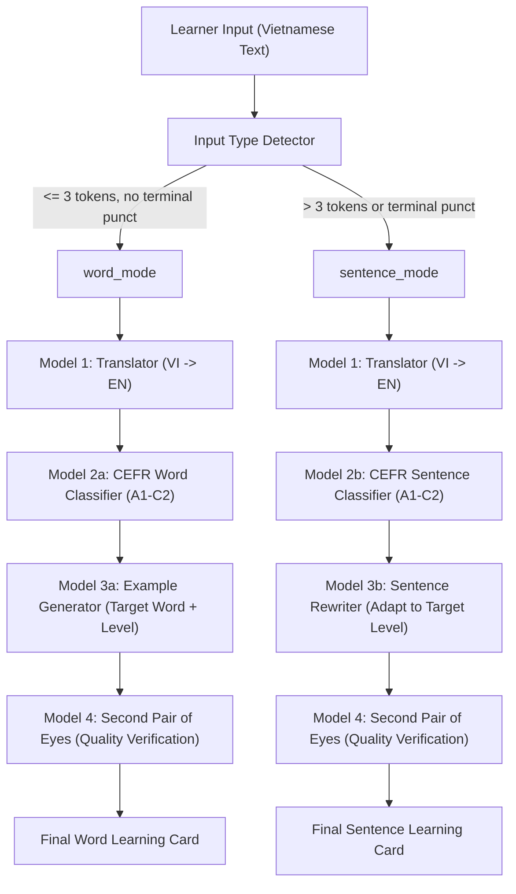

# Task Formulation & System Architecture: CapyVocab ML

## 1. Motivation & Real-World Context (CapyVocabApp)

In contemporary language learning platforms such as **CapyVocabApp**, learners encounter two primary interaction modalities when attempting to acquire and practice English vocabulary:
1. **Querying specific vocabulary words or short phrases** (e.g., searching for the English equivalent of a Vietnamese concept, finding its CEFR proficiency level, and generating natural example sentences).
2. **Submitting full sentences or paragraphs** (e.g., translating a thought from Vietnamese to English, checking whether the generated English sentence is too easy/hard for their current level, and adapting the sentence to a target CEFR level).

Traditional dictionary applications only provide static bilingual lookups and predefined example sentences. However, dynamic pedagogical systems require **personalized, context-aware vocabulary assistance**. Learners at the A2 level cannot effectively learn from complex C1-level example sentences with intricate subordinate clauses, while advanced C1 learners require sophisticated collocations and nuanced expressions.

To power **CapyVocabApp**, the backend Machine Learning system (**CapyVocab ML**) must dynamically:
- Translate learner intent from Vietnamese to English ($VI \to EN$).
- Accurately assess the CEFR proficiency level of both single lexical units ($A1 \to C2$) and complete sentences.
- Generate level-appropriate contextual examples and rewrite sentences to match target proficiency levels.
- Automatically verify and sanitize outputs through an automated quality control layer (*Second Pair of Eyes*).

---

## 2. Overall System Input/Output & Dual-Branch Architecture

The system receives raw text input in Vietnamese from the user and automatically determines the downstream processing path via the `Input Type Detector`:

### 2.1 Branch A: `word_mode`
- **Input**: Vietnamese word or phrase (e.g., *"kiên trì"*, *"thực hiện"*).
- **Pipeline**:
  1. Translate to candidate English target word/phrase (*"persevere"*).
  2. Classify lexical difficulty ($C1$).
  3. Generate a natural, level-tailored English example sentence containing the target word (*"She persevered through all obstacles to complete her degree."*).
  4. Verify lexical inclusion, grammatical correctness, and CEFR level consistency.
- **Output**: Complete vocabulary card (English translation, phonetic/POS, CEFR level, level-appropriate example sentence).

### 2.2 Branch B: `sentence_mode`
- **Input**: Full Vietnamese sentence (e.g., *"Tôi đang cố gắng cải thiện khả năng giao tiếp của mình."*).
- **Pipeline**:
  1. Translate to English (*"I am striving to enhance my interpersonal communication abilities."*).
  2. Classify the sentence CEFR level ($B2 / C1$).
  3. Rewrite/simplify or elevate the sentence to a target CEFR level requested by the learner (e.g., simplify to $A2$: *"I am trying to speak English better with people."*).
  4. Verify meaning preservation, fluency, and target CEFR adherence.
- **Output**: Multi-level sentence analysis (translation, original CEFR level, level-adapted sentence rewrites).

---

## 3. Why Machine Learning is Essential (Rule-Based Limitations)

Rule-based heuristics (such as regex matching, static lookup dictionaries, or purely heuristic syllable-counting formulas) completely fail in modern adaptive language education due to several fundamental NLP challenges:

### 3.1 Limitations of Rule-Based Translation & Generation
- **Contextual Polysemy**: A word like *"chạy"* can translate to *"run"*, *"operate"*, *"execute"*, or *"drive"* depending on context. Rule-based dictionaries cannot perform disambiguation.
- **Generative Diversity**: Generating realistic, natural example sentences cannot be templated with simple slot-filling without creating awkward, unnatural language.

### 3.2 The Asymmetric Complexity: Sentence CEFR vs. Word CEFR
Evaluating **Sentence Difficulty (Model 2b)** is fundamentally more non-linear and complex than evaluating **Single Word Difficulty (Model 2a)**:

| Dimension | Word Difficulty (Model 2a) | Sentence Difficulty (Model 2b) | Why ML is Required for Sentences |
| :--- | :--- | :--- | :--- |
| **Primary Determinants** | Lexical frequency (Zipf score), word length, morphological complexity (affixes). | Interplay of individual word levels, grammatical structures, syntactic depth, discourse coherence, sentence length. | A sentence composed solely of simple A1/A2 words can reach C1 complexity due to inversion, mixed conditionals, or subjunctive structures (e.g., *"Had you told me earlier, I would not have gone."*). |
| **Syntactic Non-Linearity** | Not applicable (isolated token). | Highly non-linear (dependency tree depth, subordinate clauses, passive voice, cleft sentences). | Rule-based heuristics (e.g., average word level or character count) completely miss syntactic nuance and clause subordination depth. |
| **Feature Interaction** | Features are largely independent (e.g., character length correlates with frequency). | Complex feature interactions (dense lexical items + short clause vs. sparse words + nested structure). | Gradient Boosted Decision Trees (XGBoost) and Transformer Encoders (DeBERTa) capture dense feature interactions and hierarchical context that linear rules cannot model. |

---

## 4. Comprehensive Model Specifications (Models 1 to 4)

Below is the complete architectural specification for all 6 models comprising CapyVocab ML:

| Model ID | Module Name | Task Formulation | Input | Output | Extracted Features / Architecture | Target Label / Loss Metric |
| :--- | :--- | :--- | :--- | :--- | :--- | :--- |
| **Model 1** | **Translator** | Seq2Seq Neural Machine Translation ($VI \to EN$) | Vietnamese string (word, phrase, or sentence) | English translated string | Pre-trained Sequence-to-Sequence Encoder-Decoder (`Helsinki-NLP/opus-mt-vi-en`) | Cross-Entropy Loss / SacreBLEU, ROUGE-L, TER |
| **Model 2a** | **CEFR Word Classifier** | 6-Class Ordinal Classification ($A1 \to C2$) | English word/phrase | CEFR Level $\in \{A1, A2, B1, B2, C1, C2\}$ | **15+ Tabular Features**: Zipf frequency (`wordfreq`), syllable count (`pyphen`), char length, vowel ratio, POS tag, Dale-Chall score (`textstat`) | Class label $y \in \{0, \dots, 5\}$ / Multi-class Log-Loss, Macro F1, Adjacent Accuracy ($\pm 1$) |
| **Model 2b** | **CEFR Sentence Classifier** | 6-Class Sentence-Level Readability Classification | English full sentence | CEFR Level $\in \{A1, A2, B1, B2, C1, C2\}$ | **Hybrid Architecture**:  1. Syntactic & Readability features (Flesch-Kincaid, ARI, Gunning Fog, dependency tree depth via `spaCy`, POS distribution). 2. DeBERTa-v3 token embeddings. | Class label $y \in \{0, \dots, 5\}$ / Weighted Cross-Entropy, Quadratic Weighted Kappa (QWK) |
| **Model 3a** | **Example Generator** | Conditional Context Generation | Target English word + Target CEFR level | English example sentence illustrating target word at target level | Conditioned Seq2Seq / Instruction Fine-Tuned LM with prompt formatting `[WORD] [LEVEL]` | Generation NLL Loss / Perplexity, BLEU, BERTScore, Word Inclusion Rate |
| **Model 3b** | **Sentence Rewriter** | Controlled Style & Complexity Transfer | English sentence + Target CEFR level | Rewritten English sentence at target CEFR level | Controllable Seq2Seq / Prompted Rewriter (`t5-base` / `bart-base`) with target level constraint tokens | Token Cross-Entropy / SARI score, Semantic Similarity (Cosine SIM with original), Level Match Rate |
| **Model 4** *(Optional/Filter)* | **Second Pair of Eyes** | Multi-criteria Quality Verification & Filtering | Generated/Rewritten sentence + metadata (target word, target level, original sentence) | Binary Verdict (`ACCEPT` / `REJECT`) + Quality Scores | Rule-based constraints (Exact word presence, length bounds) + Classifier confidence thresholds + Grammar score | Composite Quality Score $\ge \tau$ (Precision-oriented threshold) |

---

## 5. Summary & Next Steps in Phase 1

With the mathematical and architectural formulation established:
- **Phase 1 Part A**: Deploy `input_type_detector.py` to route user queries deterministically.
- **Phase 1 Part B**: Construct feature engineering pipelines (`src/data/features.py`) and data curation scripts for both CEFR Word and CEFR Sentence datasets.
